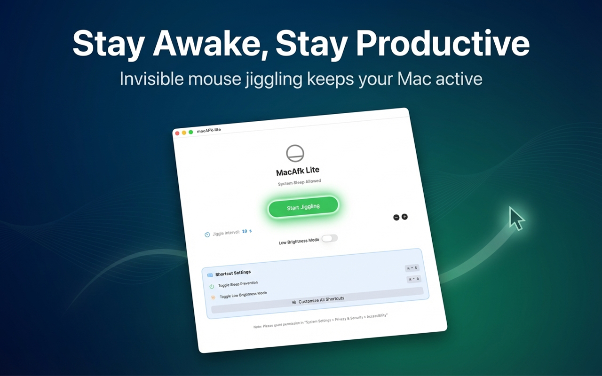

# MacAfk Lite - macOS Anti-Sleep Tool

<p align="center">
  
  
  
</p>

<p align="center">
  <a href="README.md">English</a> | <a href="README_CN.md">中文</a>
</p>

**⚠️ This is the App Store version, using _software-based brightness adjustment_ by adding a mask overlay to adjust screen brightness.  
For _hardware-based brightness control_, please use **[MacAfk Pro](https://github.com/jiayuqi7813/macAFK-Pro/releases)**.**

This is mainly because the macOS App Store has sandbox restrictions that prevent hardware brightness control, so software-based dimming is used instead.

>Many enterprise macOS systems are managed by MDM, preventing users from modifying screen lock settings. Additionally, many people now assign tasks to LLM Agents and then attend to other matters. Screen locking can cause these AI tasks to fail, which is why this tool was developed.

>You can run it with confidence - it prevents your system from sleeping through subtle mouse movements (completely imperceptible) that keep your computer active.

---

## ✨ Key Features

### 🖱️ Anti-Sleep Functionality
- **Automatic Mouse Jiggling** - Prevents system from entering sleep mode
- **Adjustable Intervals** - 6 levels from 10 seconds to 10 minutes
- **Imperceptible Operation** - 1-pixel movement, completely non-intrusive

### 🌙 Smart Brightness Control
- **Software Dimming** - Uses Gamma table for software brightness adjustment, App Store compatible
- **Low Brightness Mode** - One-click screen dimming to protect your eyes
- **Sandboxed Security** - Fully compliant with App Store security requirements

### ⌨️ Powerful Keyboard Shortcuts System
- **Global Shortcuts** - Quick control even when running in background
- **Fully Customizable** - Visual editor with real-time shortcut recording
- **Auto-Save** - Persistent configuration that survives restarts

### 🎨 Modern Interface
- **Built with SwiftUI** - Native macOS experience
- **Menu Bar Integration** - Lightweight, doesn't occupy Dock space
- **Intuitive Operation** - Clear status display at a glance

---

## 🚀 Quick Start

### Download & Install

#### App Store
- App Store: Search for "MacAfk Lite" (Coming Soon)

### First Run

1. **Grant Accessibility Permissions**
   - Open "System Settings" → "Privacy & Security" → "Accessibility"
   - Add MacAfk Lite and enable it

2. **Launch the App**
   - Click the menu bar icon
   - Or use the shortcut `⌘ ⌃ S`

3. **Start Using**
   - Enable anti-sleep: Click button or press `⌘ ⌃ S`
   - Enable low brightness: Toggle switch or press `⌘ ⌃ B`

---

## ⌨️ Default Shortcuts

| Shortcut | Function |
|----------|----------|
| `⌘ ⌃ S` | Toggle Anti-Sleep |
| `⌘ ⌃ B` | Toggle Low Brightness Mode |
| `⌘ ⌃ ↑` | Increase Jiggle Interval |
| `⌘ ⌃ ↓` | Decrease Jiggle Interval |

**Customize Shortcuts**: Click the "Customize All Shortcuts" button in the main interface

---

## 🔧 Build from Source

### Requirements
- macOS 14+
- Xcode 13.0+
- Swift 5.0+

### Build Steps

#### Quick Build
```bash
cd macAFK-lite
xcodebuild -scheme MacAfk -configuration Release-AppStore build
```

#### Using Build Script
```bash
# Build Lite version using automated script
./build.sh
```

---

## 🛠️ Technical Architecture

```
MacAfk Lite
├── AppModel.swift              # Application state management
├── BrightnessControl.swift     # Gamma table brightness control
├── Jiggler.swift               # Mouse jiggling engine
├── ShortcutManager.swift       # Keyboard shortcut system
├── ShortcutEditorView.swift    # Shortcut editor
├── ContentView.swift           # Main interface
├── SettingsView.swift          # Settings interface
└── AppDelegate.swift           # Menu bar integration
```

---

## 🤝 Contributing

Contributions, issues, and feature requests are welcome!

### Development Workflow
1. Fork this repository
2. Create your feature branch (`git checkout -b feature/AmazingFeature`)
3. Commit your changes (`git commit -m 'Add some AmazingFeature'`)
4. Push to the branch (`git push origin feature/AmazingFeature`)
5. Open a Pull Request

### Code Standards
- Follow official Swift coding style
- Add necessary comments
- Update relevant documentation

---

## 📄 License

This project is licensed under the MIT License - see the [LICENSE](LICENSE) file for details

---

## 💬 Contact

- **Report Issues**: [GitHub Issues](https://github.com/jiayuqi7813/macAFK-lite/issues)
- **Feature Requests**: [GitHub Discussions](https://github.com/jiayuqi7813/macAFK-lite/discussions)

---

<p align="center">
  <strong>⭐️ If this project helps you, please give it a Star!</strong>
</p>

<p align="center">
  Made with ❤️ for macOS users
</p>
